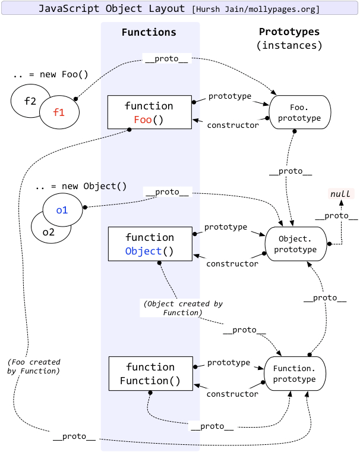

### 原型 (Prototype)
在JavaScript中，每个对象都有一个原型对象，对象会从原型继承属性和方法。
#### 原型对象
```js
// 构造函数
function Person(name) {
  this.name = name;
}

// 在原型上添加方法
Person.prototype.sayHello = function() {
  console.log(`Hello, I'm ${this.name}`);
};

// 创建实例
const person = new Person('John');
person.sayHello(); // Hello, I'm John
```

#### 原型属性
```js
// 查看原型
console.log(Person.prototype); // { sayHello: [Function] }
console.log(person.__proto__); // { sayHello: [Function] }
console.log(Object.getPrototypeOf(person)); // { sayHello: [Function] }

// 检查原型关系
console.log(person.__proto__ === Person.prototype); // true
console.log(Person.prototype.constructor === Person); // true
```

### 原型链 (Prototype Chain)
原型链是JavaScript实现继承的主要方式，它是由一系列原型对象组成的链式结构。



#### 原型链的形成
```js
function Animal(name) {
  this.name = name;
}

Animal.prototype.eat = function() {
  console.log(`${this.name} is eating`);
};

function Dog(name, breed) {
  Animal.call(this, name);
  this.breed = breed;
}

// 设置原型链
Dog.prototype = Object.create(Animal.prototype);
Dog.prototype.constructor = Dog;

Dog.prototype.bark = function() {
  console.log(`${this.name} is barking`);
};

const dog = new Dog('Buddy', 'Golden Retriever');
dog.eat(); // Buddy is eating
dog.bark(); // Buddy is barking
```

#### 原型链的查找过程
1. 首先在对象自身查找属性
2. 如果找不到，则查找对象的原型
3. 如果还找不到，则继续查找原型的原型
4. 直到找到属性或到达原型链的末端（null）

```js
console.log(dog.name); // Buddy
console.log(dog.breed); // Golden Retriever
console.log(dog.eat); // [Function: eat]
console.log(dog.bark); // [Function: bark]
```

### 继承方式
#### 1. 原型链继承
```js
function Parent() {
  this.name = 'parent';
}

Parent.prototype.sayName = function() {
  console.log(this.name);
};

function Child() {
  this.name = 'child';
}

Child.prototype = new Parent();
Child.prototype.constructor = Child;

const child = new Child();
child.sayName(); // child
```

#### 2. 构造函数继承
父类原型上的方法不会被继承
```js
function Parent(name) {
  this.name = name;
}

parent.prototype.sayName = function() {}  // 不会被继承 

function Child(name, age) {
  Parent.call(this, name);
  this.age = age;
}

const child = new Child('John', 20);
console.log(child.name); // John
console.log(child.age); // 20
console.log(child.sayName()); // undefined
```

#### 3. 组合继承
```js
function Parent(name) {
  this.name = name;
}

Parent.prototype.sayName = function() {
  console.log(this.name);
};

function Child(name, age) {
  Parent.call(this, name);
  this.age = age;
}

Child.prototype = Object.create(Parent.prototype);
Child.prototype.constructor = Child;

const child = new Child('John', 20);
child.sayName(); // John
```

#### 4. 寄生组合继承
```js
function inheritPrototype(Child, Parent) {
  const prototype = Object.create(Parent.prototype);
  prototype.constructor = Child;
  Child.prototype = prototype;
}

function Parent(name) {
  this.name = name;
}

Parent.prototype.sayName = function() {
  console.log(this.name);
};

function Child(name, age) {
  Parent.call(this, name);
  this.age = age;
}

inheritPrototype(Child, Parent);

const child = new Child('John', 20);
child.sayName(); // John
```

### 常见面试题
1. **原型链的终点**
```js
console.log(Object.prototype.__proto__); // null
```

2. **instanceof 原理**
```js
function myInstanceof(left, right) {
  let proto = left.__proto__;
  while (proto) {
    if (proto === right.prototype) {
      return true;
    }
    proto = proto.__proto__;
  }
  return false;
}

console.log(myInstanceof([], Array)); // true
console.log(myInstanceof([], Object)); // true
```

3. **new 操作符的实现**
```js
function myNew(Constructor, ...args) {
  const obj = Object.create(Constructor.prototype);
  const result = Constructor.apply(obj, args);
  return result instanceof Object ? result : obj;
}

function Person(name) {
  this.name = name;
}

const person = myNew(Person, 'John');
console.log(person.name); // John
```

### 最佳实践
1. 使用`Object.create()`创建对象，而不是直接修改`__proto__`
2. 在构造函数中定义实例属性，在原型中定义共享方法
3. 使用`Object.getPrototypeOf()`获取原型，而不是直接访问`__proto__`
4. 使用`Object.setPrototypeOf()`设置原型，而不是直接修改`__proto__`
5. 使用`Object.create(null)`创建没有原型的对象
6. 使用`Object.assign()`合并对象，而不是修改原型
7. 使用`class`语法糖，它提供了更清晰的继承语法
