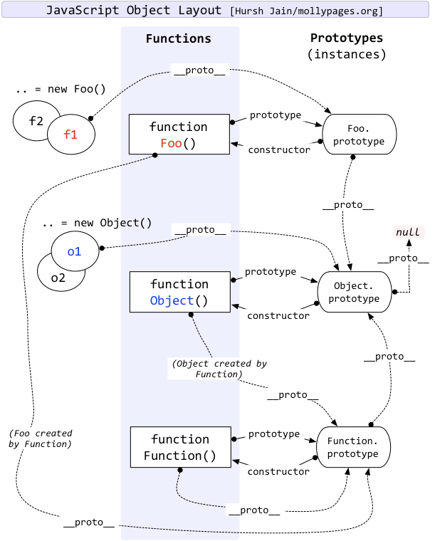

### 原型 (Prototype)
JavaScript 是基于原型的语言。每个对象拥有一个**原型对象**，对象从原型继承方法和属性。

#### 原型对象
- **`prototype`**：构造函数特有的属性，指向原型对象。
- **`__proto__`**：实例对象特有的属性（隐式原型），指向构造函数的 `prototype`。
- **关系**：`instance.__proto__ === Constructor.prototype`

```js
// 构造函数
function Person(name) {
  this.name = name;
}

// 在原型上添加方法
Person.prototype.sayHello = function() {
  console.log(`Hello, I'm ${this.name}`);
};

// 创建实例
const person = new Person('John');
person.sayHello(); // Hello, I'm John
```

#### 原型属性
推荐使用 `Object.getPrototypeOf(obj)` 获取原型，而不是非标准的 `__proto__`。

```js
// 查看原型
console.log(Person.prototype); // { sayHello: [Function] }
console.log(person.__proto__); // { sayHello: [Function] }
console.log(Object.getPrototypeOf(person)); // { sayHello: [Function] }

// 检查原型关系
console.log(person.__proto__ === Person.prototype); // true
console.log(Person.prototype.constructor === Person); // true
```

### 原型链 (Prototype Chain)
**原型链**是实现继承的核心机制。
当访问一个对象的属性时，如果对象本身没有该属性，引擎会沿着 `__proto__` 链向上查找，直到找到该属性或到达链的末端（`null`）。



#### 原型链的形成
通过将一个构造函数的原型设置为另一个构造函数的实例，可以建立继承关系。

```js
function Animal(name) {
  this.name = name;
}

Animal.prototype.eat = function() {
  console.log(`${this.name} is eating`);
};

function Dog(name, breed) {
  Animal.call(this, name);
  this.breed = breed;
}

// 设置原型链
Dog.prototype = Object.create(Animal.prototype);
Dog.prototype.constructor = Dog;

Dog.prototype.bark = function() {
  console.log(`${this.name} is barking`);
};

const dog = new Dog('Buddy', 'Golden Retriever');
dog.eat(); // Buddy is eating
dog.bark(); // Buddy is barking
```

#### 原型链的查找过程
1. **自身查找**：检查对象实例本身是否有该属性。
2. **原型查找**：如果没有，通过 `__proto__` 去原型对象找。
3. **链式上溯**：如果原型对象也没有，继续通过原型的 `__proto__` 找。
4. **终点**：直到找到 `Object.prototype`，其 `__proto__` 为 `null`，查找结束。

```js
console.log(dog.name); // Buddy
console.log(dog.breed); // Golden Retriever
console.log(dog.eat); // [Function: eat]
console.log(dog.bark); // [Function: bark]
```

### 继承方式
面试中常考的几种继承方式演进。

#### 1. 原型链继承
**核心**：将子类的原型指向父类的实例。
**缺点**：
1. 引用类型的属性被所有实例共享（修改一个影响所有）。
2. 创建子类实例时无法向父类传参。

```js
function Parent() {
  this.name = 'parent';
}

Parent.prototype.sayName = function() {
  console.log(this.name);
};

function Child() {
  this.name = 'child';
}

Child.prototype = new Parent();
Child.prototype.constructor = Child;

const child = new Child();
child.sayName(); // child
```

#### 2. 构造函数继承
**核心**：在子类构造函数中调用 `Parent.call(this)`。
**优点**：解决了引用属性共享和传参问题。
**缺点**：只能继承父类实例属性，**无法继承父类原型上的方法**。

```js
function Parent(name) {
  this.name = name;
}

// Parent.prototype.sayName = function() {}  // 不会被继承 

function Child(name, age) {
  Parent.call(this, name);
  this.age = age;
}

const child = new Child('John', 20);
console.log(child.name); // John
console.log(child.age); // 20
// console.log(child.sayName()); // 报错，无法访问
```

#### 3. 组合继承 (最常用)
**核心**：原型链继承 + 构造函数继承。
**优点**：既能传参，又能继承原型方法。
**缺点**：调用了**两次**父类构造函数（一次在设置原型时，一次在 call 时），导致子类原型上多了一份多余的父类实例属性。

```js
function Parent(name) {
  this.name = name;
}

Parent.prototype.sayName = function() {
  console.log(this.name);
};

function Child(name, age) {
  Parent.call(this, name); // 第二次调用
  this.age = age;
}

Child.prototype = new Parent(); // (注意：这里更推荐用 Object.create) 第一次调用
Child.prototype.constructor = Child;

const child = new Child('John', 20);
child.sayName(); // John
```

#### 4. 寄生组合继承 (最佳实践)
**核心**：使用 `Object.create(Parent.prototype)` 创建一个空对象作为子类原型，避免调用父类构造函数。
**优点**：最完美的 ES5 继承方案，只调用一次父类构造函数。

```js
function inheritPrototype(Child, Parent) {
  const prototype = Object.create(Parent.prototype); // 创建对象
  prototype.constructor = Child;                     // 增强对象
  Child.prototype = prototype;                       // 赋值对象
}

function Parent(name) {
  this.name = name;
}

Parent.prototype.sayName = function() {
  console.log(this.name);
};

function Child(name, age) {
  Parent.call(this, name);
  this.age = age;
}

inheritPrototype(Child, Parent);

const child = new Child('John', 20);
child.sayName(); // John
```

### 常见面试题
1. **原型链的终点**
   - 绝大多数对象的原型链终点是 `Object.prototype`。
   - `Object.prototype.__proto__` 是 `null`。

```js
console.log(Object.prototype.__proto__); // null
```

2. **instanceof 原理**
   - 只要右边构造函数的 `prototype` 出现在左边实例的原型链上，就返回 `true`。

```js
function myInstanceof(left, right) {
  let proto = Object.getPrototypeOf(left);
  while (proto) {
    if (proto === right.prototype) {
      return true;
    }
    proto = Object.getPrototypeOf(proto);
  }
  return false;
}

console.log(myInstanceof([], Array)); // true
console.log(myInstanceof([], Object)); // true
```

3. **new 操作符的实现**
   1. 创建一个空对象，继承构造函数的原型。
   2. 执行构造函数，将 `this` 绑定到新对象。
   3. 如果构造函数返回了对象，则返回该对象；否则返回新对象。

```js
function myNew(Constructor, ...args) {
  // 1. 创建新对象，并链接原型
  const obj = Object.create(Constructor.prototype);
  // 2. 绑定 this 并执行
  const result = Constructor.apply(obj, args);
  // 3. 处理返回值
  return (result instanceof Object) ? result : obj;
}

function Person(name) {
  this.name = name;
}

const person = myNew(Person, 'John');
console.log(person.name); // John
```

### 最佳实践
1. **优先使用 class**：ES6 的 `class` 是寄生组合继承的语法糖，更清晰、更标准。
2. **避免修改 `__proto__`**：这是一个耗性能的操作，且非标准。使用 `Object.create()` 或 `Object.setPrototypeOf()`（也不推荐频繁使用）。
3. **不要扩展原生原型**：不要给 `Object.prototype` 或 `Array.prototype` 添加方法，容易造成命名冲突和覆盖。

---

## 高频追问与深层原理

### ES6 class 的底层实现：寄生组合继承的语法糖

ES6 的 `class` 语法让继承看起来更直观，但底层仍是寄生组合继承。

#### class 语法到 ES5 的转换

```js
// 原始 class 写法
class Person {
  constructor(name) {
    this.name = name
  }

  sayHello() {
    console.log(`Hello, I'm ${this.name}`)
  }
}

class Student extends Person {
  constructor(name, grade) {
    super(name)
    this.grade = grade
  }

  study() {
    console.log(`${this.name} is studying`)
  }
}
```

 Babel 转译后大概等价于：

```js
// 寄生组合继承的 ES5 版本
function Person(name) {
  this.name = name
}

Person.prototype.sayHello = function() {
  console.log(`Hello, I'm ${this.name}`)
}

function Student(name, grade) {
  Person.call(this, name)
  this.grade = grade
}

// 关键：Object.create 实现继承
Student.prototype = Object.create(Person.prototype)
Student.prototype.constructor = Student

Student.prototype.study = function() {
  console.log(`${this.name} is studying`)
}

// extends 关键字还处理了静态属性继承
Student.__proto__ = Person
```

#### extends 关键字的特殊处理

```js
class Student extends Person {
  static create(name) {
    // 静态方法中的 this 指向类本身
    return new Student(name, 'A')
  }
}

// Student.__proto__ = Person，所以可以访问
Student.create === Student.create // false，等于 Person.create
```

#### super 关键字的限制

```js
class Parent {
  constructor() {
    this.name = 'parent'
  }
}

class Child extends Parent {
  constructor() {
    // 必须先调用 super，才能使用 this
    console.log(this) // ReferenceError: Must call super before using 'this'
    super()
  }
}

// 另一个常见错误
class Child extends Parent {
  constructor() {
    super()
    // super 必须在 return 之前调用
    return {} // 不能 return 对象字面量，会覆盖 this
  }
}
```

---

### Object.create 的其他用途

#### 1. 创建无原型对象（避免原型链查找开销）

```js
// 没有原型链，对象只有自身属性
const pureObj = Object.create(null)
pureObj.name = 'test'

// 避免 toString 等默认方法的干扰
// pureObj.toString // undefined，不会找到 Object.prototype.toString
```

#### 2. 对象属性描述符（第三参数）

`Object.create` 的第二个参数可以定义属性，比 `Object.defineProperties` 更灵活：

```js
const obj = Object.create(null, {
  name: {
    value: 'John',
    writable: false,      // 不可写
    configurable: false,   // 不可删除或重新配置
    enumerable: false      // 不可枚举
  },
  age: {
    value: 20,
    writable: true,
    configurable: true,
    enumerable: true
  }
})

obj.name = 'Jane' // 静默失败（严格模式报错）
Object.keys(obj) // ["age"] - name 不可枚举
```

#### 3. 性能优化：缓存函数结果

```js
const memoize = (fn) => {
  const cache = Object.create(null)

  return (arg) => {
    if (arg in cache) {
      return cache[arg]
    }
    return (cache[arg] = fn(arg))
  }
}

const slowFib = memoize((n) => {
  if (n <= 1) return n
  return slowFib(n - 1) + slowFib(n - 2)
})
```

#### 4. 实现原型链隔离（混合组合继承的变体）

```js
function mixin(target, source) {
  const sourceProto = source.prototype || source
  const targetProto = target.prototype || target

  return Object.create(targetProto, Object.getOwnPropertyDescriptors(sourceProto))
}
```

---

### 原型链查找的性能问题与优化

#### 原型链层级过深的代价

```js
function A() {}
function B() {}
function C() {}
function D() {}

B.prototype = Object.create(A.prototype)
C.prototype = Object.create(B.prototype)
D.prototype = Object.create(C.prototype)

const d = new D()

// 查找 d.name 需要遍历：
// d -> D.prototype -> C.prototype -> B.prototype -> A.prototype -> Object.prototype -> null
// 7 个步骤
```

#### V8 的隐藏类（Hidden Classes）优化

V8 为每个对象创建隐藏类（结构相同的对象共享），属性访问是 O(1)：

```js
const obj = { a: 1, b: 2 } // V8 创建隐藏类 C0

obj.c = 3 // V8 创建新隐藏类 C1，属性变为 [a, b, c]

// 相同结构的对象共享隐藏类，属性偏移固定
const obj2 = { a: 1, b: 2 } // 复用 C0
```

#### 保持原型链扁平化的最佳实践

```js
// 错误：每次赋值都破坏隐藏类
function Point(x, y) {
  this.x = x
  this.y = y
}

const p1 = new Point(1, 2)
const p2 = new Point(3, 4)

// 正确：一次性定义所有属性
function Point(x, y) {
  this.x = x
  this.y = y
  this.z = 0 // 提前声明，防止隐藏类变化
}
```

#### 属性访问优化建议

| 操作 | 优化建议 |
|------|----------|
| 深层原型链 | 缓存中间结果 |
| 频繁访问的属性 | 提取到局部变量 |
| 动态属性赋值 | 避免在构造函数中动态添加 |
| for...in 循环 | 使用 Object.keys 替代 |

---

### 原型链常见追问

#### 追问1：为何 instanceof 不适合判断数组？

```js
const arr = []
arr instanceof Array // true
arr instanceof Object // true

// 更可靠的方式
Array.isArray(arr) // true
Object.prototype.toString.call(arr) // "[object Array]"
```

#### 追问2：原型链修改会导致 instanceof 失效？

```js
function A() {}
const a = new A()

// 手动修改实例的原型
Object.setPrototypeOf(a, Array.prototype)

a instanceof Array // true
a instanceof A // false - 失效了！
```

#### 追问3：多层继承的 constructor 指向问题

```js
function A() {}
function B() {}
function C() {}

B.prototype = Object.create(A.prototype)
C.prototype = Object.create(B.prototype)

const c = new C()
c.constructor === C // false，实际上是 A
c.constructor === A // true

// 必须手动修复
C.prototype.constructor = C
```

#### 追问4：为何不推荐直接设置 `__proto__`？

```js
// 耗性能：__proto__ 是 getter/setter，有额外开销
obj.__proto__ = new prototype

// 推荐：Object.create
obj = Object.create(new prototype)

// 或 Object.setPrototypeOf（也不推荐频繁使用）
Object.setPrototypeOf(obj, new prototype)
```

---

## 面试回答模板

**问题**：JavaScript 原型链与继承的实现原理？

**高分回答**：

> JavaScript 通过原型链实现继承。每个对象都有 `__proto__` 属性指向构造函数的原型对象，原型对象也有自己的 `__proto__`，形成链式查找。
>
> 继承演进经历了：原型链继承（共享问题）→ 构造函数继承（无法继承原型）→ 组合继承（两次调用）→ 寄生组合继承（最优）。
>
> ES6 的 `class` 语法是寄生组合继承的语法糖，`extends` 关键字处理了原型链链接和静态属性继承。
>
> 实际开发中注意：避免深层原型链（影响查找性能），不要修改原生原型链（影响 instanceof），用 `Object.create` 而非 `__proto__` 设置原型。

---

## 相关链接

- [MDN 继承与原型链](https://developer.mozilla.org/zh-CN/docs/Web/JavaScript/Inheritance_and_the_prototype_chain)
- [MDN class 语法](https://developer.mozilla.org/zh-CN/docs/Web/JavaScript/Reference/Classes)
- [V8 隐藏类博客](https://v8.dev/blog/elements-kinds)
